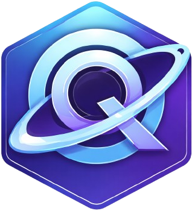

<div align="center">



# **Quantum Language** 🚀

[](https://en.wikipedia.org/wiki/C%2B%2B17)
[](LICENSE)
[](https://github.com/SENODROOM/QuantumLangCodeExplaination)
[](https://github.com/SENODROOM/QuantumLangCodeExplaination)

> **🔒 Cybersecurity-ready scripting language with modern C++ architecture**

---

</div>

## 🌟 Overview

**Quantum Language** is a cutting-edge scripting language designed specifically for cybersecurity operations. Built with modern C++17, it combines powerful features with enterprise-grade security and performance.

### ✨ Key Features

- 🏗️ **Tree-walk interpreter architecture** for efficient execution
- 🔍 **Complete lexical analysis and parsing pipeline**
- 🎯 **Dynamic type system with OOP support**
- 🌍 **Cross-platform compatibility** (Windows, Linux, macOS)
- 🛡️ **Extensive cybersecurity-focused library**
- 📝 **Static type checking** with detailed error reporting
- 🔗 **Reference parameters** and advanced pointer types
- ⚡ **High-performance** with modern C++ optimizations

---

## 📚 Documentation Structure

### 🔧 **Source Modules** (`src/`)

| Module | Description | Status |
|--------|-------------|--------|
| **[`main/`](./src/main/)** | 🚀 Entry point, CLI interface, and REPL | ✅ Complete |
| **[`token/`](./src/token/)** | 🏷️ Token string representation utilities | ✅ Complete |
| **[`value/`](./src/value/)** | 💎 Value type system, environment, OOP | ✅ Complete |
| **[`lexer/`](./src/lexer/)** | 🔤 Lexical analysis and tokenization | ✅ Complete |
| **[`parser/`](./src/parser/)** | 🌳 Recursive descent parser with Pratt parsing | ✅ Complete |
| **[`interpreter/`](./src/interpreter/)** | ⚡ Tree-walk interpreter engine | ✅ Complete |
| **[`typechecker/`](./src/typechecker/)** | 🔍 Static type analysis and validation | ✅ **NEW** |

### 📂 **Header Libraries** (`include/`)

| Library | Components | Purpose |
|---------|-------------|---------|
| **[`Token/`](./include/Token/)** | Token definitions, structs | Lexical analysis |
| **[`Value/`](./include/Value/)** | Value system, environments | Runtime type system |
| **[`Lexer/`](./include/Lexer/)** | Lexer interface, methods | Tokenization |
| **[`Parser/`](./include/Parser/)** | Parser interface, parsing | AST construction |
| **[`Interpreter/`](./include/Interpreter/)** | Interpreter interface, execution | Runtime execution |
| **[`AST/`](./include/AST/)** | AST node definitions | Syntax tree structure |
| **[`Error/`](./include/Error/)** | Exception hierarchy, colors | Error handling |

### 🏛️ **Architecture Documentation**
- **[`STRUCTURE.md`](./STRUCTURE.md)** - 📐 Complete architecture overview and component relationships

---

## 🔄 Architecture Flow


### 📋 Pipeline Stages

1. **🔤 Lexical Analysis** - Source code tokenization into meaningful units
2. **🌳 Parsing** - Token organization into Abstract Syntax Tree
3. **🔍 Type Checking** - Static analysis for type safety and error detection
4. **⚡ Interpretation** - AST traversal and execution using tree-walk pattern

---

## 🎯 Design Patterns

| Pattern | Implementation | Benefit |
|----------|----------------|---------|
| **👥 Visitor Pattern** | Interpreter AST traversal | Clean separation of concerns |
| **🔄 Variant-based AST** | `std::variant` for type-safe nodes | Compile-time type safety |
| **🔗 Environment Chain** | Lexical scoping with inheritance | Proper variable resolution |
| **⚡ Function Objects** | `std::function` for native functions | High performance |
| **🧠 RAII** | Smart pointers throughout | Memory safety |
| **🔍 Static Type Analysis** | Comprehensive type checking | Early error detection |

---

## 💻 Language Features

### 🎨 **Core Language Constructs**

```cpp
// Variables with type hints and references
let name: string = "Quantum";
let count: int& = getCounter();  // Reference parameter

// Functions with closures
function calculate(x: int, y: int) -> int {
    return x * y + 42;
}

// Classes with inheritance
class Hacker : SecurityExpert {
    constructor(name: string) {
        super(name);
        this.skills = ["crypto", "networking"];
    }
}
```

### 🚀 **Advanced Features**

- 📦 **Variables** (let/const) with type hints and reference parameters
- 🎯 **Functions & Lambdas** with closures and pass-by-reference support
- 🏗️ **Classes** with inheritance and methods
- 📚 **Arrays & Dictionaries** with comprehensions
- 🔄 **Control Flow** (if/elif/else, while, for, break/continue)
- ⚠️ **Exception Handling** (try/except/finally)
- 📝 **Template Literals** and string interpolation
- 📁 **Import System** with filesystem operations
- 🛡️ **Cybersecurity Functions** - specialized built-in operations
- 🔍 **Static Type Checking** - optional type validation and error detection

---

## 🆕 What's New in v2.0

### 🔥 **Enhanced Type System**
- 📌 **Reference Parameters**: `int& ref` syntax support
- 🎯 **Pointer Types**: `QuantumPointer` for reference-like behavior
- ✨ **Enhanced Truthiness**: Improved truth value evaluation
- 🔍 **Static Type Analysis**: Comprehensive type checking with detailed errors

### 🖥️ **Improved CLI**
- 🧪 **Test Mode**: `--test` flag for automated testing
- 📁 **Filesystem Operations**: Enhanced `std::filesystem` support
- ⚠️ **Better Error Handling**: Comprehensive error reporting

### 📚 **Enhanced Standard Library**
- 🔢 **Extended Math Functions**: Additional mathematical operations
- 📊 **Improved I/O**: Better file and console operations
- 🔒 **Security Functions**: Enhanced cybersecurity-focused built-ins

### 📖 **Documentation Improvements**
- 🧹 **Clean Format**: Removed line number clutter
- 📝 **Enhanced Explanations**: More detailed code documentation
- 🎨 **Better Organization**: Improved structure and navigation
- 💼 **Professional Presentation**: Clean, readable format

---

## 🛠️ Installation & Compilation

### 📋 **Prerequisites**
- **C++17** compatible compiler (GCC 7+, Clang 5+, MSVC 2017+)
- **CMake** 3.12 or higher
- **Git** for version control

### 🔨 **Build Instructions**

```bash
# Clone the repository
git clone https://github.com/SENODROOM/QuantumLangCodeExplaination.git
cd QuantumLangCodeExplaination

# Create build directory
mkdir build && cd build

# Configure and build
cmake ..
make          # Linux/macOS
# or
cmake --build .  # Windows with MSVC

# Run the interpreter
./quantum --help
```

### 🐧 **Package Managers**

```bash
# Ubuntu/Debian (coming soon)
sudo apt-get install quantum-language

# macOS (coming soon)
brew install quantum-language

# Windows (coming soon)
winget install QuantumLanguage
```

---

## 🧪 Testing & Usage

### 🧪 **Run Tests**
```bash
# Basic test execution
quantum --test test_script.sa

# Verbose testing
quantum --test --verbose test_suite/

# Continuous integration mode
quantum --test --ci tests/
```

### 💻 **Interactive Mode**
```bash
# Start REPL
quantum

# Execute with file
quantum script.sa

# Debug mode
quantum --debug script.sa
```

### 📝 **Example Code**
```quantum
# Hello World with style
print("🚀 Welcome to Quantum Language!");

# Cybersecurity operations
let hash = sha256("secret_data");
print("Hash: " + hash);

# Array operations
let ports = [80, 443, 8080, 3000];
let open_ports = ports.filter(port => scan_port(port));
print("Open ports: " + open_ports);
```

---

## 📊 Documentation Quality

Our documentation has been **completely enhanced** to provide:

| ✅ Feature | 📝 Description |
|------------|----------------|
| 🧹 **Clean Explanations** | No line number clutter, focused on functionality |
| 📚 **Comprehensive Coverage** | All components documented in detail |
| 🎨 **Professional Formatting** | Consistent, readable structure throughout |
| 🔍 **Enhanced Context** | Detailed explanations with practical examples |
| 🏗️ **Consistent Structure** | Unified format across all documentation files |
| 🌟 **Modern Design** | Visually appealing with badges and formatting |

---

## 🤝 Contributing

We welcome contributions! Here's how you can help:

### 🐛 **Bug Reports**
- Open an issue with detailed description
- Include reproduction steps and expected behavior
- Provide system information and compiler details

### 💡 **Feature Requests**
- Describe the feature and use case
- Explain why it would be valuable
- Suggest implementation approach if possible

### 🔧 **Pull Requests**
- Fork the repository and create a feature branch
- Follow the existing code style and documentation patterns
- Add tests for new functionality
- Ensure all tests pass before submitting

### 📖 **Documentation**
- Improve existing documentation
- Add examples and tutorials
- Fix typos and grammatical errors
- Translate documentation to other languages

---

## 📄 License

This project is licensed under the **MIT License** - see the [LICENSE](LICENSE) file for details.

---

## 🙏 Acknowledgments

- **C++ Community** for excellent standard library features
- **Cybersecurity Experts** for domain-specific requirements
- **Open Source Contributors** for valuable feedback and improvements
- **Quantum Computing Community** for inspiration and naming

---

## 📞 Contact & Support

- 🐛 **Issues**: [GitHub Issues](https://github.com/SENODROOM/QuantumLangCodeExplaination/issues)
- 💬 **Discussions**: [GitHub Discussions](https://github.com/SENODROOM/QuantumLangCodeExplaination/discussions)
- 📧 **Email**: [Contact Maintainers](mailto:contact@quantum-lang.org)
- 🌐 **Website**: [Quantum Language Official](https://quantum-lang.org)

---

<div align="center">

### ⭐ **Star this project if you find it useful!**

[🔝 Back to Top](#quantum-language-)

---

*Built with ❤️ for the cybersecurity community*

</div>
